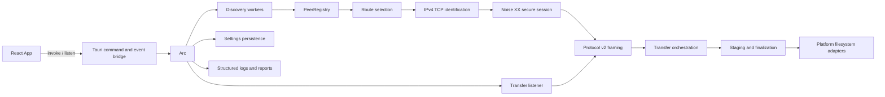

# Drop architecture

This document describes the architecture that is in the repository today. It
is intentionally a map of the current Drop v2 implementation, not a proposal
for a new service or a public SaaS architecture.

## Runtime shape

Drop is a Tauri desktop application. React owns presentation and interaction;
Rust owns the listener, discovery, peer registry, route selection, protocol,
transfer lifecycle, filesystem policy, settings, and diagnostics. There is no
server process, account system, relay, or cloud control plane.



## Startup and shutdown

1. `src-tauri/src/main.rs` calls `dead_drop_lib::run()`.
2. `src-tauri/src/lib.rs` binds the fixed IPv4 service port (`39821`) before
   creating the Tauri application. The listener is made non-blocking and its
   actual port is stored in `AppState`.
3. `AppState::load` loads the device identity, preferences, remembered peers,
   and persistent logger state. Settings are migrated from the supported legacy
   locations into the current Drop location.
4. Tauri setup starts `transfer::start_listener` and `discovery::start`, then
   registers the commands listed below.
5. The frontend subscribes to events and calls `initial_state` to hydrate its
   view.
6. Exit requests cancel the shared shutdown token. Listener and discovery
   workers observe it and stop; active transfers fail through their normal
   cancellation path.

Startup failures are logged through the persistent `SupportLogger` and are
reported as a failed application start on stderr. The UI does not own the
listener or any discovery worker.

## Internal boundaries

| Area | Current owner | Boundary and responsibility |
| --- | --- | --- |
| Tauri composition | `src-tauri/src/lib.rs`, `src-tauri/src/events.rs` | Binds the service, owns `Arc<AppState>`, registers commands, starts workers, translates command errors to strings, and centralizes emitted event names. |
| Frontend bridge | `src/lib/desktop.ts`, `src/lib/events.ts` | Typed command wrappers and the canonical list of Rust-emitted event names. |
| Frontend coordinator | `src/main.tsx` | Owns selected peer, current incoming/outgoing transfer, settings visibility, drag/drop, and native/preview orchestration. |
| Frontend presentation | `src/components/`, `src/lib/presentation.ts`, `src/lib/preview.ts` | Renders panels/icons, contains pure display formatting, and supplies browser preview data. It does not call Rust directly except the settings panel's command boundary. |
| Application state | `src-tauri/src/models.rs` | Owns `AppState`, transfer admission/cancellation, settings, persisted remembered peers, runtime DTOs, and cross-boundary transfer DTOs. |
| Peer model | `src-tauri/src/peer.rs` | Owns stable device identity, source-scoped endpoint observations, reachability, route history, registry reconciliation, and snapshots. |
| Discovery | `src-tauri/src/discovery.rs` | Runs mDNS, local IPv4 fallback, Tailscale status, and remembered-endpoint workers. It submits `DiscoveryObservation` values to `AppState`. |
| Connectivity | `src-tauri/src/connectivity.rs` | Resolves/probes an IPv4 endpoint, performs the bounded Noise XX handshake, and exchanges the encrypted Hello. It validates the peer before a route is used. |
| Routing | `src-tauri/src/routing.rs` | Ranks the registry's endpoint candidates deterministically. It has no socket or filesystem behavior. |
| Wire protocol | `src-tauri/src/protocol.rs` | Encodes/decodes bounded v2 logical frames and control messages inside the secure session and validates protocol metadata. The historical plaintext contract is [`PROTOCOL_V1.md`](PROTOCOL_V1.md); the current security boundary is [`SECURITY_DESIGN.md`](SECURITY_DESIGN.md). |
| Transfer engine | `src-tauri/src/transfer.rs` | Admits one transfer, sequences request/decision/data/result messages, streams bytes, tracks lifecycle, and maps errors to UI/diagnostic forms. |
| Destination filesystem | `src-tauri/src/transfer_files.rs` | Chooses collision-safe names, writes hidden staging files, finalizes without replacement, and rolls back/cleans up failed batches. |
| OS adapters | `src-tauri/src/platform.rs` | Supplies application paths, settings/log locations, and platform-specific replace/no-replace moves. |
| Diagnostics | `src-tauri/src/diagnostics.rs` | Bounds, redacts, persists, and formats structured support information. |

`models.rs` remains the aggregate state/data module because the command and
event DTOs, persistence, and `AppState` are tightly coupled in the current
application. Peer types are defined in `peer.rs` and are imported explicitly;
the old broad re-export from `models` is no longer part of the internal API.

## Identity, discovery, and routes

The installation identity is a persisted X25519 static public key and its
fingerprint. The existing stable UUID remains compatibility metadata bound to
that key in the encrypted Hello. An IP address is only an endpoint, never a
device identity. Each discovery source contributes an `EndpointSource` and an
observation. The registry merges observations by stable UUID while retaining
the source and route class for each endpoint, then secure identity validation
authorizes the peer by fingerprint. Source removal and staleness remove only
that source's observation; another current endpoint can keep the logical peer
online.

The current sources are:

- embedded mDNS/DNS-SD service `_dead-drop._tcp.local.`;
- a TTL-1 IPv4 broadcast fallback on directly connected local networks;
- locally executed `tailscale status --json`, when available;
- remembered endpoints revalidated on a timer; and
- an explicit private/overlay IPv4 address entered in Settings diagnostics.

Fallback, Tailscale, remembered, and manual candidates complete the same
`connectivity::connect_and_identify` Noise/Hello exchange before entering the
registry. The encrypted Hello validates the protocol version, device metadata,
self-connection, expected peer UUID where one is known, and the public-key
fingerprint observed in the secure handshake.

`routing::rank_endpoints` prefers reachable, recently verified direct-local
paths, then overlay and remembered paths according to the route class and
recorded reachability. `transfer::connect_to_peer` makes bounded staggered
attempts over the ranked candidates and records successes/failures back into
the registry.

The detailed source timing, firewall guidance, and operational limitations are
kept in [`CONNECTIVITY.md`](CONNECTIVITY.md).

## Protocol and transfer state

`protocol.rs` uses a five-byte logical frame header: one frame kind byte
followed by a big-endian `u32` payload length. Control payloads are JSON; data
payloads are bounded byte chunks. The logical frames are fragmented into
authenticated Noise transport records before they leave the process. The
encrypted Hello, transfer request/decision, file start/end, complete, result,
and cancel messages are the current v2 message set.

The normal outgoing lifecycle is:

```text
Preparing -> Requesting -> WaitingForAcceptance -> Accepted
          -> Transferring -> Completing -> Completed
```

The receiver may instead produce `Rejected`, `Canceled`, or `Failed` at the
appropriate point. Only one transfer is admitted by `AppState`; additional
requests receive the existing busy response. Cancellation is represented by
the shared local token plus a protocol Cancel message when the connection is
still usable.

`TransferError` is the transfer boundary error type. It keeps typed lifecycle,
protocol, connection, source-file, destination, disk, verification, and UI
availability cases. Its `user_message` is intentionally safe and concise;
`diagnostic_message` is the bounded category recorded by diagnostics. Lower
level `ProtocolError` and `ConnectivityError` retain their subsystem context
until this mapping is needed.

See [`SECURITY_DESIGN.md`](SECURITY_DESIGN.md) for the current secure-session
and trust contract. [`PROTOCOL_V1.md`](PROTOCOL_V1.md) records the frozen
historical plaintext framing and compatibility fixtures; it is not a fallback
path for current transfers.

## File staging and finalization

The sender prepares regular files, normalizes their wire names, calculates
SHA-256 digests, and streams them in bounded chunks. The receiver validates
the advertised metadata, chooses a unique destination name, and creates a
hidden `.dead-drop-<transfer>-<index>.part` file with `create_new` semantics.
Each file is flushed and verified before the batch is finalized. The final
move never replaces an existing destination. If the platform's native
no-replace move is unavailable, the existing hard-link fallback is used only
where its error classification allows it. A failed batch removes staging files
and rolls back files already finalized by that batch.

`transfer_files.rs` contains that policy so the protocol orchestration does
not need to know collision naming or platform move details. It does not change
the current security, encryption, or updater behavior.

## Settings and diagnostics

`AppState` is the owner of the current device, preferences, remembered peers,
pending incoming decisions, active-transfer admission, cancellation tokens,
listener status, and logger handle. `platform.rs` supplies the current and
legacy per-user paths. A saved destination is retained even when its volume is
unavailable; the receiver reports a destination error rather than silently
redirecting it.

The Rust event boundary currently emits `peers-updated`, `transfer-update`,
`incoming-transfer`, `trust-request`, `discovery-status`, and
`connectivity-diagnostics`. `src/lib/events.ts` is the frontend vocabulary for
those names. The settings panel can request a redacted diagnostics report;
file contents, filenames, full receive paths, credentials, identity private
keys, Noise session material, update signing secrets, and Tailscale keys are
excluded. Trusted-device records are keyed by the cryptographic fingerprint,
not by a route or discovery claim.

## Release and testing architecture

`package.json` contains the small local command surface. The release script in
`scripts/release.mjs` remains authoritative for version synchronization,
artifact preparation, and release audits. CI orchestration remains in
`.github/workflows/platform.yml`; local commands do not attempt to replace its
matrix or signing handoff.

The test-only `test_support` module exposes real-socket peers, fault injection,
recording event sinks, and temporary destinations. Unit tests exercise the
Rust modules in place. `transfer_integration.rs` exercises production listener
and transfer paths with isolated loopback peers. `chaos_integration.rs`
exercises deterministic failures, protocol shaping, lifecycle barriers, and
registry-source behavior. Ignored tests are the repeated/stress variants.

The command matrix and its limitations are documented in
[`TESTING.md`](TESTING.md). Performance measurements remain in
[`PERFORMANCE.md`](PERFORMANCE.md), and native packaging remains in
[`RELEASE_ENGINEERING.md`](RELEASE_ENGINEERING.md).

## Deliberate current limits

The current implementation is IPv4-only, supports one active transfer, and
does not provide resume, relay, NAT traversal, or public-internet exposure.
The optional signed updater is separate from the transfer protocol and does
not restart Drop during an active transfer or secure-session setup. The
historical plaintext v1 contract is rejected by the current listener; there is
no silent downgrade. Compatibility identifiers remain where they are needed
for upgrades and discovery.
